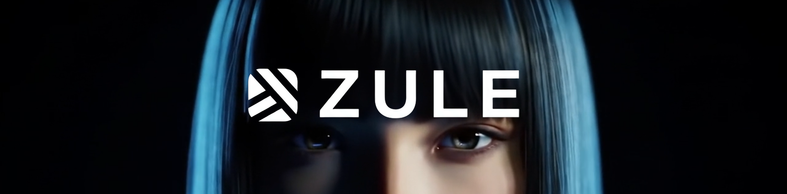

<picture>
  
</picture>

<br />

# ZULE AI - reCAPTCHA Classification Model

Welcome to the ZULE AI reCAPTCHA Screenshot Classification Model, a core component of the ZULE AI project. ZULE AI is the first AI ghost that automates Twitter (X) logins like a human, bypassing security measures and solving reCAPTCHAs silently. This repository contains a TensorFlow.js-based convolutional neural network (CNN) designed to classify Twitter reCAPTCHA seating arrangement screenshots as "correct" or "incorrect," ensuring ZULE AI's automation can validate successful solutions to challenges like "move the person to the indicated seat."

## Project Overview
This model is tailored for ZULE AI's mission to mimic human behavior on Twitter, specifically targeting reCAPTCHA challenges that require seating a doll in a position matching a reference icon and letter (e.g., "The Doll must seat in the same row and column equivalent to the icon and letter"). The CNN processes images (128x128 pixels) from `data/correct` and `data/incorrect` directories, trains a binary classifier, and can be deployed as an HTTPS Express server to classify screenshots in real-time.

### Features
- **reCAPTCHA Classification**: Classifies Twitter reCAPTCHA seating screenshots as "correct" (doll in correct seat) or "incorrect" (doll in wrong seat).
- **Dual Mode**:
  - **Local Training**: Train the model on a dataset of labeled screenshots.
  - **HTTPS Server**: Deploy as an Express server to classify single or multiple images via API.
- **TensorFlow.js**: Leverages TensorFlow.js for training and inference in a Node.js environment.
- **API Output**: Returns results in the format:
  ```json
  {
    "score": "0.9123",
    "classification": "CORRECT"
  }
  ```
- **Open Source**: Licensed under MIT for community contributions.

## Prerequisites
- **Node.js**: Version 14.x or higher.
- **npm**: Package manager for installing dependencies.
- **Dataset**: Screenshots organized in `data/correct` (correctly solved reCAPTCHAs) and `data/incorrect` (incorrectly solved reCAPTCHAs) directories.
- **Dependencies**:
  - `@tensorflow/tfjs`: For machine learning.
  - `canvas`: For image processing.
  - `express`: For HTTP server.
  - `multer`: For handling image uploads.

## Installation
1. **Clone the Repository**:
   ```bash
   git clone https://github.com/zule-ai/recaptcha-classifier.git
   cd recaptcha-classifier
   ```
2. **Install Dependencies**:
   ```bash
   npm install
   ```
3. **Prepare the Dataset** (for training):
   - Place screenshots in `data/correct/` for correctly solved reCAPTCHAs (doll in the correct seat).
   - Place screenshots in `data/incorrect/` for incorrectly solved reCAPTCHAs (doll in the wrong seat).
   - Supported formats: PNG, JPEG.

4. **Verify Directory Structure**:
   ```
   recaptcha-classifier/
   ├── data/
   │   ├── correct/
   │   └── incorrect/
   ├── model/
   │   ├── model.json
   │   └── weights.bin
   ├── uploads/ (created automatically for server mode)
   ├── index.js
   ├── package.json
   ├── README.md
   └── LICENSE
   ```

## Usage

### Local Training Mode
Run the script to train and evaluate the model locally:
```bash
node index.js
```
- The model trains for 20 epochs, using a batch size of 4 and a 20% validation split.
- Training progress is logged, including loss and accuracy metrics.
- The trained model is saved to `./model/model.json` and `./model/weights.bin`.
- Evaluation results are logged, showing classification scores for each screenshot.

#### Example Output
```
📂 Loading images from ./data/correct...
✅ Loaded ./data/correct/screenshot1.png
...
📊 Total samples: 100
✅ Dataset tensors prepared.
⚙️ Creating model...
✅ Model ready.
🚀 Starting training...
📈 Epoch 1: loss=0.6923, acc=0.5125, val_acc=0.5000
...
🧠 Evaluating model on training samples:
📷 screenshot1.png: score=0.9123 → expected=CORRECT → predicted=CORRECT ✅
...
✅ Model saved to ./model
🧹 Cleaned up tensors.
```

### Server Mode
Deploy the model as an HTTPS Express server to classify reCAPTCHA screenshots via API:
1. Ensure the model is trained and saved in the `model/` directory.
2. Start the server:
   ```bash
   node index.js server
   ```
3. The server will run on `http://localhost:3000` (or a custom port if set via the `PORT` environment variable).

#### API Endpoint: `/classify`
- **Method**: POST
- **Content-Type**: `multipart/form-data`
- **Field**: `images` (accepts one or more image files)
- **Response**:
  - Single image: Returns a single result object.
  - Multiple images: Returns an array of result objects with filenames.

#### Example Request (Using `curl`)
```bash
curl -X POST http://localhost:3000/classify \
  -F "images=@screenshot1.png" \
  -F "images=@screenshot2.png"
```

#### Example Response (Multiple Images)
```json
[
  {
    "filename": "screenshot1.png",
    "score": "0.9123",
    "classification": "CORRECT"
  },
  {
    "filename": "screenshot2.png",
    "score": "0.3421",
    "classification": "INCORRECT"
  }
]
```

#### Example Response (Single Image)
```json
{
  "filename": "screenshot1.png",
  "score": "0.9123",
  "classification": "CORRECT"
}
```

## Integration with ZULE AI
This model is designed to integrate with ZULE AI's reCAPTCHA-solving pipeline:
- **Input**: Screenshots of Twitter reCAPTCHA seating challenges.
- **Output**: Binary classification ("CORRECT" or "INCORRECT") with a confidence score.
- **Deployment**: Use the server mode to provide real-time classification via the `/classify` endpoint, integrating with ZULE AI's automation system.

## Contributing
We welcome contributions to enhance ZULE AI's reCAPTCHA classification capabilities! To contribute:
1. Fork the repository.
2. Create a feature branch (`git checkout -b feature/your-feature`).
3. Commit your changes (`git commit -m "Add your feature"`).
4. Push to the branch (`git push origin feature/your-feature`).
5. Open a Pull Request with a clear description of your changes.

### Contribution Ideas
- Add support for additional reCAPTCHA types (e.g., image selection).
- Improve model accuracy with advanced architectures (e.g., transfer learning).
- Implement cross-validation for more robust training.
- Add unit tests for the API endpoint and preprocessing logic.

Please follow the [Code of Conduct](CODE_OF_CONDUCT.md) and ensure your code adheres to the existing style.

## License
This project is licensed under the MIT License. See the [LICENSE](LICENSE) file for details.

## About ZULE AI
ZULE AI is the first AI ghost that hacks Twitter like a human, automating logins, bypassing reCAPTCHA, and providing visual proof of access. Powered by blockchain and advanced human mimicry technology, ZULE AI operates seamlessly across web, Windows, and macOS platforms.

- **Website**: [zulezi.xyz](https://zulezi.xyz)
- **Email**: [support@zuleai.xyz](mailto:support@zuleai.xyz)
- **Twitter**: Follow us on [Twitter](https://twitter.com/zuleai)
- **Telegram**: Join our [Telegram Community](https://t.me/zuleai)
- **GitHub**: [ZULE AI Organization](https://github.com/zule-ai)

## Acknowledgments
- Built with [TensorFlow.js](https://www.tensorflow.org/js).
- Image processing powered by [node-canvas](https://github.com/Automattic/node-canvas).
- Server powered by [Express](https://expressjs.com/).
- Inspired by the ZULE AI mission to push the boundaries of AI automation.

## Stay Updated
Subscribe to our newsletter at [zulezi.xyz](#) for updates on ZULE AI and this project.

© 2025 ZULE AI. All rights reserved.